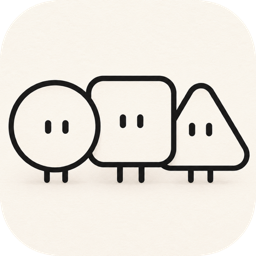
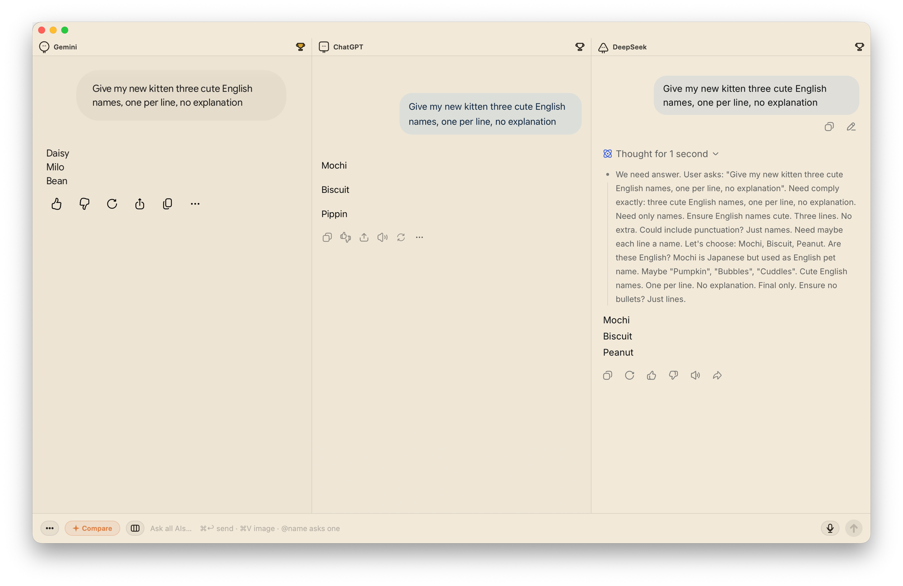

<p align="center">
  
</p>

<h1 align="center">Chorus</h1>

<p align="center">
  One question, every AI at once.<br>
  A native Mac app that puts ChatGPT, Claude, Gemini and more side by side,<br>
  signed in with the accounts you already have. No API key needed.
</p>

<p align="center">
  <a href="https://askchorus.app"><b>Download</b></a> · <a href="https://askchorus.app">askchorus.app</a>
</p>



## What it does

- **Side by side** — one prompt reaches every AI at once and the answers land next to each other. No tab-hopping.
- **Compare in one click** — add any OpenAI-compatible API model and it reads every answer, then lays out where they agree and where they split.
- **Keep score** — click the trophy for the best answer; over time you learn which AI suits your work.
- **Quick ask** — press ⌘⇧C anywhere for a small composer, and ask them all without leaving what you're doing.
- **Ask just one** — type @ in the composer and pick one AI; only that panel gets the follow-up, the others keep their answers.
- **Images too** — paste a screenshot into the composer and it goes to all of them at once.
- **Focus mode** — hides each site's own top bar, sidebar and input box, so every panel shows just the conversation.

ChatGPT, Claude and Gemini are built in. DeepSeek, Grok, Perplexity, Le Chat, Kimi, Manus, Genspark, MiniMax, GLM, Qwen, Doubao and Yuanbao are one click away, and you can add any other site.

## How it works

Chorus just opens each AI's own website, signed in with the accounts you already have. When you send, it types your question into each site's input box and presses send, as you would, then watches the page to tell when the answer is done. Questions and answers go straight between your Mac and those sites — the same as using a browser.

Because it works through the sites' own pages, a redesign on one of them can break sending or answer detection there until Chorus catches up. Updates arrive automatically.

## Install

Download Chorus from [askchorus.app](https://askchorus.app), open the .dmg and drag Chorus into your Applications folder. macOS 13 or later; Apple silicon and Intel.

macOS blocks the first launch: click **Done** in the dialog (not the blue **Move to Trash**), then open System Settings → Privacy & Security and click **Open Anyway** — or run `xattr -cr /Applications/Chorus.app` in Terminal. Only the first time; updates never ask again.

## Build from source

```bash
git clone https://github.com/askchorus/chorus.git
cd chorus
swift build                # debug build
swift test
./scripts/build-app.sh     # release bundle in build/Chorus.app, ad-hoc signed
```

You need macOS 13 or later and Xcode or the Swift toolchain.

`mcp/` holds an MCP server that lets a coding agent (Claude Code, Codex…) put a question to the AIs open in Chorus and read their answers back. It is off by default; see [mcp/README.md](mcp/README.md).

## Feedback

Email [smileduck@duck.com](mailto:smileduck@duck.com?subject=Chorus%20feedback) or open an issue.

## License

Chorus is free software under the [GNU General Public License v3.0](LICENSE).

The name "Chorus", the app icon and the hand-drawn characters are not covered by that license: a modified version you distribute needs its own name and look.

Third-party parts keep their own licenses: [Sparkle](https://github.com/sparkle-project/Sparkle) (MIT), Resource Han Rounded ([SIL OFL 1.1](scripts/fonts/OFL-ResourceHanRounded.txt)) and Nunito ([SIL OFL 1.1](promo/fonts/OFL.txt)).
